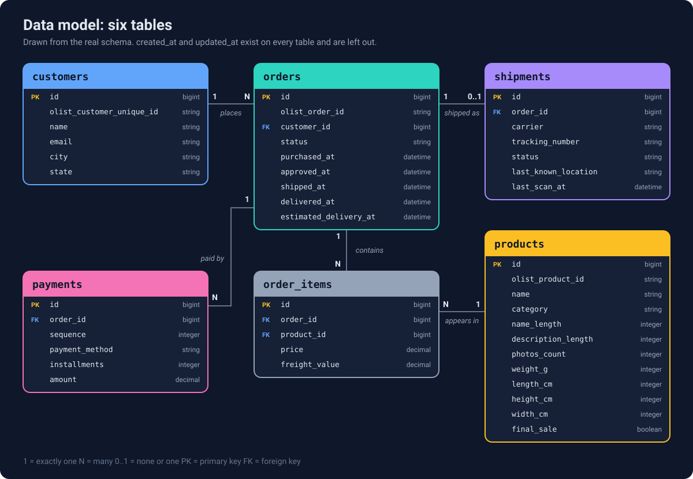
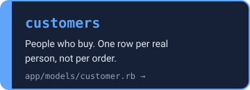
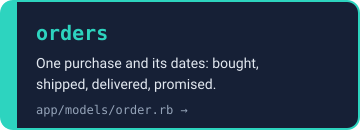
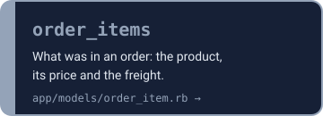
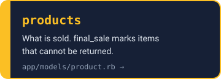
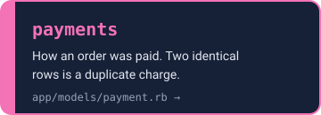
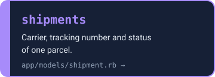
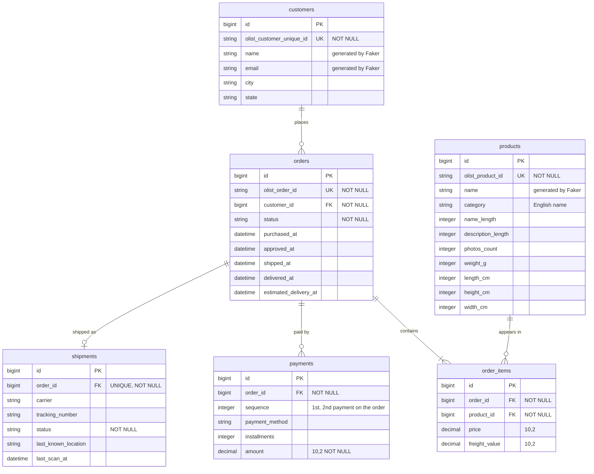

# Data model

The support agent's database: who the customers are, what they ordered, how they paid and where
the package is. This is the data the read tools (`get_order`, `get_shipment`, `get_customer`,
`search_orders`) will query. It is built in Lesson 1 and is the same set of tables every later lesson uses.

## Diagram

<p align="center">
  
</p>

**Click a table to open its model:**

<p align="center">
  <a href="../app/models/customer.rb"></a>
  <a href="../app/models/order.rb"></a>
  <a href="../app/models/order_item.rb"></a>
  <a href="../app/models/product.rb"></a>
  <a href="../app/models/payment.rb"></a>
  <a href="../app/models/shipment.rb"></a>
</p>

<details>
<summary>Mermaid version (also shows unique keys and NOT NULL)</summary>



</details>

`created_at` and `updated_at` exist on every table and are left out of both diagrams to keep them readable.

<details>
<summary>Text version</summary>

- A **customer** places many **orders** (one customer, zero or more orders).
- An **order** contains one or more **order items**. Each item points at one **product**, so
  `order_items` is the join table between orders and products (many to many).
- An order has zero or more **payments**. More than one is normal (a voucher plus a card).
- An order has zero or one **shipment**, enforced by a unique index on `shipments.order_id`.

</details>

## How to read the Mermaid version

| Symbol | Meaning |
| --- | --- |
| `\|\|--o{` | exactly one on the left, zero or many on the right |
| `\|\|--\|{` | exactly one on the left, one or many on the right |
| `\|\|--o\|` | exactly one on the left, zero or one on the right |
| PK, FK, UK | primary key, foreign key, unique index |

## Why it looks like this

- **Integer primary keys, plus an `olist_*_id` column.** Olist ids are 32-character hex strings.
  Integer ids are smaller, faster to join and read naturally (`/orders/1042`). The Olist id is kept only so
  the import can match rows across files, so it has a unique index.
- **One `Customer` per real person.** Olist creates a new `customer_id` for every order and keeps a stable
  `customer_unique_id` for the person. We store the stable one, so `customer.orders` shows a person's whole
  history, which a support agent needs ("this is their third late delivery"). The import translates each
  per-order `customer_id` to the right person while loading orders.
- **`order_items` is the middle table.** An order has many products and a product is in many orders, so the
  link lives in its own table, with the price paid at purchase time.
- **Money is `decimal(10, 2)`, never float.** Floats store 58.90 as 58.8999..., which is a real bug when the
  agent computes a refund.
- **Payments are separate rows.** About 3% of Olist orders have more than one payment. `sequence` is how the
  duplicate charge scenario tells a legitimate split payment from being charged twice.
- **`shipments` is its own table, with no copy of the dates.** Olist has no shipment data, so it is generated.
  `orders` already holds `shipped_at` and `delivered_at`. The shipment adds what only the carrier knows:
  carrier, tracking number, status and the last scan. A package whose last scan was 12 days ago looks lost
  even if its status still says `in_transit`.
- **The database enforces the rules, not only Rails.** `null: false`, unique indexes and foreign keys mean a
  console typo or a future script cannot create a half-valid row.
- **Deletes.** Items, payments and the shipment die with their order (`dependent: :destroy`). Orders are
  never deleted with their customer or product, so order history is protected by the foreign keys.

## Where each table comes from

| Table | Source | Notes |
| --- | --- | --- |
| `customers` | Olist customers file | Collapsed to one row per `customer_unique_id`. `name` and `email` generated. |
| `products` | Olist products file plus category translation file | English category. Olist misspells two column names as `lenght`, fixed here. `name` generated. `final_sale` is not from Olist: it is false by default and set by a planted scenario. |
| `orders` | Olist orders file | Timestamps renamed (`order_delivered_customer_date` becomes `delivered_at`). |
| `order_items` | Olist order items file | Seller, shipping limit and item number are skipped, the agent does not need them. |
| `payments` | Olist order payments file | `payment_type` becomes `payment_method`, to avoid clashing with Ruby's built-in `method`. |
| `shipments` | Generated by `data:generate_shipments` | One per order that was handed to a carrier, built from its shipped and delivered dates. `data:plant_scenarios` runs this first, then edits five orders. |

Olist `sellers`, `geolocation` and `reviews` are not used, because a support agent does not need them yet.

## Associations in Rails

```
Customer   has_many :orders
Order      belongs_to :customer
           has_many :order_items, dependent: :destroy
           has_many :products, through: :order_items
           has_many :payments, dependent: :destroy
           has_one :shipment, dependent: :destroy
OrderItem  belongs_to :order, :product
Product    has_many :order_items
           has_many :orders, through: :order_items
Payment    belongs_to :order
Shipment   belongs_to :order
```

The source of truth is always `db/schema.rb`. If the two ever disagree, fix this page.
