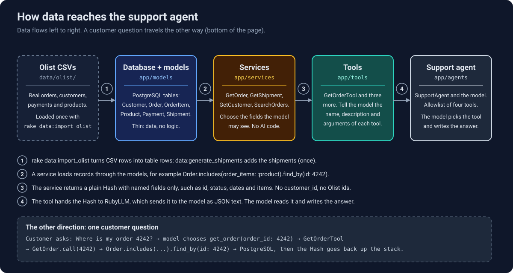

# Lesson 3: tool calling with read tools

The agent stops guessing and starts looking things up. Four read-only tools (order, shipment, customer,
order search) are written as plain Ruby, wrapped for RubyLLM, and handed to `SupportAgent`. The model
decides which one to call; the code does the lookup.

Last updated: 2026-10-10

## Status

- [x] RubyLLM 2.x tool API read from the installed gem source, not from memory
- [x] Tool shape decided: logic in `app/services/`, a thin `RubyLLM::Tool` wrapper per tool in `app/tools/`
- [x] `GetOrder`, `GetShipment`, `GetCustomer`, `SearchOrders` with specs
- [x] `SupportAgent` has an allowlist of the four tools
- [x] Console proof: the model picks `get_order`, `get_shipment` and `search_orders` for matching questions
- [x] Specs for the services, the wrappers, and one recorded tool-calling run
- [ ] Tag `lesson-03` on the merge commit of the lesson 3 pull request

## How data reaches the agent

<p align="center">
  
</p>

<details>
<summary>Text version</summary>

Data moves left to right through five layers:

1. **Olist CSVs** (`data/olist/`): real orders, customers, payments and products. `rake data:import_olist`
   loads them once, and `data:generate_shipments` adds the shipments.
2. **Database and models** (`app/models`): PostgreSQL tables read through `Customer`, `Order`,
   `OrderItem`, `Product`, `Payment` and `Shipment`. Thin: data, no logic.
3. **Services** (`app/services`): `GetOrder`, `GetShipment`, `GetCustomer`, `SearchOrders`. Each loads
   records through the models and returns a plain Hash with named fields only. No AI code.
4. **Tools** (`app/tools`): `GetOrderTool` and three more. Each tells RubyLLM the tool's name,
   description and arguments, and forwards the call to its service.
5. **Support agent** (`app/agents`): `SupportAgent` and the model. It has an allowlist of the four
   tools, decides which one to call, and writes the answer.

A customer question travels the other way: "Where is my order 4242?" leads the model to choose
`get_order(order_id: 4242)`, which runs `GetOrderTool`, then `GetOrder.call(4242)`, then
`Order.includes(...).find_by(id: 4242)` on PostgreSQL. The Hash goes back up the same path and
RubyLLM sends it to the model as JSON text.

</details>

## What was built

```
app/services/get_order.rb          order status, dates and items by order id
app/services/get_shipment.rb       carrier, tracking and last scan, by order id
app/services/get_customer.rb       name, city and state by customer id
app/services/search_orders.rb      a customer's 10 newest orders, optional status, with the real total
app/tools/*_tool.rb                one RubyLLM::Tool wrapper per service
app/agents/support_agent.rb        the allowlist (`tools ...`) and the Groq reasoning option
app/prompts/support_agent/instructions.txt.erb   now tells the model to use its tools
spec/services/, spec/tools/        each layer tested on its own
spec/agents/support_agent_spec.rb  one recorded run of the model calling a tool
```

## How a tool call works

The model never touches the database. It only says which tool to call and with what arguments:

```
question                                       "Where is my order 1? Has it arrived?"
model asks for a tool                          get_order({"order_id" => 1})
RubyLLM runs the wrapper, which calls          GetOrder.call(1)
RubyLLM sends the Hash back to the model       {"id":1,"status":"shipped","delivered_at":null,...}
model answers from the result                  "Your order #1 has been shipped ... not delivered yet."
```

`chat.ask` runs this whole loop itself and stops when the model answers instead of asking for a tool.
Lesson 4 writes the same loop by hand, one step at a time, using `step`, `generate` and `run_tools`.

What the model reads to choose a tool is the tool's `description` and argument schema, nothing else.
In the console, "Where is the package for my order 1?" led to `get_shipment`, and "I am customer 68585.
What orders have I placed?" led to `search_orders` with the customer id taken from the sentence.
`get_customer` was only tested through its specs, not with a live question.

## Design decisions

| Decision | Choice | Why |
| --- | --- | --- |
| Where the logic lives | plain classes in `app/services/`, wrappers in `app/tools/` | The same services are wrapped again for MCP in Lesson 5, and the folders match what Rails and RubyLLM developers expect. |
| Errors | a Hash `{ error: "..." }`, never a raise | The model can read a failure and react, for example "it has not shipped yet". |
| Which id | `GetShipment` takes an **order** id | Customers say "order #1042", and an order has at most one shipment. |
| Two kinds of "not found" | `GetShipment` tells "no such order" from "order has no shipment" | The model should be able to say the order has not shipped yet. |
| What the model sees | named fields only; no `email`, `customer_id` or Olist ids | The model sees only what the task needs, and whatever it sees can end up in a reply, a trace or a recording. |
| Search limits | one customer at a time, 10 results, plus the real `total` | About 100,000 orders exist and the Groq limit is 8000 tokens per minute. `total` lets the model say "10 of 17". |

## What broke

- **The old prompt forbade lookups.** The Lesson 2 prompt said "You do not have access to order data
  yet", so with the tool attached the model refused to use it. The model follows instructions over tool
  availability. Fix: the prompt now says to look orders up with the tools and to say so when a tool
  returns an error.
- **Groq rejected the follow-up request.** After a tool ran, RubyLLM sent the model's own reasoning text
  back in the assistant message, and Groq answered `property 'reasoning_content' is unsupported`.
  RubyLLM 2.1.0 has no switch for it. Fix: `provider_options include_reasoning: false` on the agent, so
  Groq never returns reasoning and there is nothing to send back.
- **A cassette went stale.** The prompt and the tool list are part of the request body and VCR matches on
  the body, so the Lesson 2 recording stopped matching. This is by design (see Lesson 2). Fix: delete it
  and record once.
- **A spec assertion failed on `nil`.** Messages that are not tool calls have `tool_calls` set to `nil`,
  so `message.tool_calls.values` raised. Fix: select with `tool_call?` first.

## Proof

One recorded run (`spec/cassettes/support_agent/looks_up_an_order.yml`), order 4242, shipped, with fixed
dates so the recording replays on any day. It holds three requests:

```
request 1: system + question                    -> model: get_order(order_id: 4242)
request 2: ... + get_order result               -> model: get_shipment(order_id: 4242)
request 3: ... + get_shipment result (an error) -> final answer
```

Nobody told the model to check the shipment. After reading the order it chose to, got "Order 4242 has no
shipment", and still answered from the order data without inventing tracking details. The spec checks that
the first tool call is `get_order` with `order_id: 4242` and that the answer mentions the status. It does
not check the number of calls, because that can change between recordings.

The data has planted oddities, such as order 1 with a 2017 estimated delivery date and a 2026 ship date. The
model reported what the tool returned. The answer is only as good as the data behind the tool.

## Scope

This shows that tool calling works end to end on a handful of questions. It does not measure how often the
model picks the right tool, or whether its answers stay grounded. That is the job of the evals in Lesson 10.

## Learn more

- [FAQ](../FAQ.md): MCP client versus server, and why the tools are plain classes with wrappers
- [Lesson 2](02-first-llm-call.md): the agent, the prompt and the recorded specs this lesson builds on
- [Data model](../DATA_MODEL.md): the tables the services read
